# Component Breakdown

This document provides a detailed breakdown of the major components in the Prayer Player application and their responsibilities.

```mermaid
graph TD
    subgraph User Interface
        A[User] --> B(Tray Icon)
        B --> C(Settings Window)
        B --> D(Focus Steps Window)
    end

    subgraph Core Application
        E[Event Bus]
        F[Scheduler]
        G[Config Service]
        H[Notification Service]
        I[Action Executor]
    end

    subgraph External Services
        J[Prayer Times API]
        K[Google Calendar API]
    end

    C -- Dispatches SaveConfigurationCommand --> E
    G -- Handles SaveConfigurationCommand --> E
    G -- Publishes ConfigurationChangedEvent --> E
    F -- Subscribes to ConfigurationChangedEvent --> E
    F -- Publishes ScheduleRefreshedEvent --> E
    F -- Publishes ApplicationStateChangedEvent --> E
    F -- Publishes PrayerTimeEvent --> E
    B -- Subscribes to ApplicationStateChangedEvent --> E
    B -- Subscribes to ScheduleRefreshedEvent --> E
    I -- Publishes AudioPlaybackRequestedEvent --> E
    I -- Publishes FocusModeRequestedEvent --> E
    H -- Subscribes to AudioPlaybackRequestedEvent --> E
    H -- Subscribes to FocusModeRequestedEvent --> E

    F --> J
    F --> K

    C -- Reads/Writes Config --> ConfigFile[Config File]
    G -- Reads/Writes Config --> ConfigFile

    I -- Triggers Actions --> H

    style A fill:#f9f,stroke:#333,stroke-width:2px
    style B fill:#bbf,stroke:#333,stroke-width:2px
    style C fill:#bbf,stroke:#333,stroke-width:2px
    style D fill:#bbf,stroke:#333,stroke-width:2px
    style E fill:#bfb,stroke:#333,stroke-width:2px
    style F fill:#fbb,stroke:#333,stroke-width:2px
    style G fill:#fbb,stroke:#333,stroke-width:2px
    style H fill:#fbb,stroke:#333,stroke-width:2px
    style I fill:#fbb,stroke:#333,stroke-width:2px
    style J fill:#ffb,stroke:#333,stroke-width:2px
    style K fill:#ffb,stroke:#333,stroke-width:2px
    style ConfigFile fill:#ddd,stroke:#333,stroke-width:2px
```

## 1. Entry Point & Composition Root (`src/__main__.py`)

-   **Role**: Acts as the application's main entry point and **Composition Root**.
-   **Responsibilities**:
    -   Initializes all major objects: `EventBus`, `ConfigService`, `NotificationService`, `PrayerScheduler`, and `ActionExecutor`.
    -   Launches the main GUI application.

## 2. Core Logic: The Scheduler (`src/scheduler.py`)

-   **Role**: The heart of the application. It orchestrates all time-based events.
-   **Responsibilities**:
    -   Manages an `apscheduler.BackgroundScheduler` instance.
    -   Fetches prayer times and schedules jobs for each prayer.
    -   Interacts with the `CalendarService` to create calendar events.

## 3. GUI Layer

-   **`src/tray_icon.py`**: Manages the system tray icon and its context menu.
-   **`src/gui/settings_window.py`**: Provides a user interface for configuring the application.
-   **`src/focus_steps_view.py` & `src/presenter/focus_steps_presenter.py`**: The interactive window that guides the user to prepare for prayer, following the MVP pattern.

## 4. Action Execution (`src/actions_executor.py`)

-   **Role**: To execute the real-world actions triggered by the scheduler.
-   **Design**: Uses the **Strategy Pattern**.
    -   `ActionExecutor` is a `Protocol` that defines the interface.
    -   `DefaultActionExecutor` is the standard strategy that publishes events to the `EventBus`.
    -   `DryRunActionExecutor` is the testing strategy that logs actions without executing them.

## 5. Services

-   **`src/services/config_service.py`**: Manages the application's configuration.
-   **`src/gui/notification_service.py`**: Handles GUI-related notifications, such as playing audio and showing the focus mode window.
-   **`src/calendar_api/`**: Abstracts interactions with external calendar services.
-   **`src/platform/service.py`**: Abstracts the logic for installing the application as a startup service.

## 6. Configuration Management (`src/config/`)

-   **Role**: To manage all user-configurable settings.
-   **Design**:
    -   `schema.py`: Uses `pydantic` to define a strict, typed data model for the configuration.
    -   `security/__init__.py`: Contains helper functions to load and save the configuration.
