# Application Design and Architecture

This document outlines the architectural design of the Prayer Player application. The application is designed to be a modular, cross-platform, and resilient system that runs in the background.

## High-Level Overview

The application follows a decoupled architecture centered around a **Scheduler**. The core logic is separated from the GUI, platform-specific features, and external service integrations. This allows for better testability, maintainability, and extensibility.

The main architectural patterns and components are:

1.  **Composition Root**: A single entry point (`__main__.py`) initializes and wires together all the major components.
2.  **Scheduler-based Core**: The central logic is driven by `apscheduler` which triggers events at specific times.
3.  **Decoupled GUI**: The user interface is built with PySide6 (Qt) and is separated into distinct, independent windows. Communication with the backend happens via a thread-safe state manager.
4.  **Strategy Pattern for Actions**: A protocol (`ActionExecutor`) is used to decouple the scheduler from the actual implementation of actions (e.g., playing sound), allowing for easy dry-run simulations.
5.  **Service Abstraction**: External services (like Google Calendar) and platform features (like startup services) are accessed through abstraction layers, hiding implementation details.

---

## Component Breakdown and Relationships

Here is a simple diagram illustrating the main data and control flow:

```mermaid
graph TD
    subgraph User Interface
        A[User] --> B(Tray Icon)
        B --> C(Settings Window)
        B --> D(Focus Steps Window)
    end

    subgraph Core Application
        E[Event Bus]
        F[Scheduler]
        G[Config Service]
        H[Notification Service]
        I[Action Executor]
    end

    subgraph External Services
        J[Prayer Times API]
        K[Google Calendar API]
    end

    C -- Dispatches SaveConfigurationCommand --> E
    G -- Handles SaveConfigurationCommand --> E
    G -- Publishes ConfigurationChangedEvent --> E
    F -- Subscribes to ConfigurationChangedEvent --> E
    F -- Publishes ScheduleRefreshedEvent --> E
    F -- Publishes ApplicationStateChangedEvent --> E
    F -- Publishes PrayerTimeEvent --> E
    B -- Subscribes to ApplicationStateChangedEvent --> E
    B -- Subscribes to ScheduleRefreshedEvent --> E
    I -- Publishes AudioPlaybackRequestedEvent --> E
    I -- Publishes FocusModeRequestedEvent --> E
    H -- Subscribes to AudioPlaybackRequestedEvent --> E
    H -- Subscribes to FocusModeRequestedEvent --> E

    F --> J
    F --> K

    C -- Reads/Writes Config --> ConfigFile[Config File]
    G -- Reads/Writes Config --> ConfigFile

    I -- Triggers Actions --> H

    style A fill:#f9f,stroke:#333,stroke-width:2px
    style B fill:#bbf,stroke:#333,stroke-width:2px
    style C fill:#bbf,stroke:#333,stroke-width:2px
    style D fill:#bbf,stroke:#333,stroke-width:2px
    style E fill:#bfb,stroke:#333,stroke-width:2px
    style F fill:#fbb,stroke:#333,stroke-width:2px
    style G fill:#fbb,stroke:#333,stroke-width:2px
    style H fill:#fbb,stroke:#333,stroke-width:2px
    style I fill:#fbb,stroke:#333,stroke-width:2px
    style J fill:#ffb,stroke:#333,stroke-width:2px
    style K fill:#ffb,stroke:#333,stroke-width:2px
    style ConfigFile fill:#ddd,stroke:#333,stroke-width:2px
```

### 1. Entry Point & Composition Root (`src/__main__.py`)

*   **Role**: Acts as the application's main entry point and **Composition Root**.
*   **Responsibilities**:
    *   Parses command-line arguments (`--dry-run`, `--install-service`, etc.).
    *   Handles one-off tasks like service installation.
    *   Initializes all major objects:
        *   `Config`
        *   `GoogleCalendarService` (if configured)
        *   `ActionExecutor` (choosing between `Default` or `DryRun` implementation).
        *   `PrayerScheduler` (injecting the other components).
    *   Launches the main GUI application via `tray_icon.setup_tray_icon`.

### 2. Core Logic: The Scheduler (`src/scheduler.py`)

*   **Role**: The heart of the application. It orchestrates all time-based events.
*   **Responsibilities**:
    *   Manages an `apscheduler.BackgroundScheduler` instance.
    *   Fetches prayer times using the `prayer_times` module.
    *   Schedules jobs for each prayer time. A "job" consists of two parts:
        1.  Triggering the focus mode window shortly before the prayer time.
        2.  Playing the adhan and du'a at the exact prayer time.
    *   Schedules a daily refresh job to fetch the next day's times.
    *   Interacts with the `CalendarService` to add busy blocks to the user's calendar.
    *   Updates the application's global state via the `StateManager`.

### 3. State Management (`src/state.py`)

*   **Role**: Provides a thread-safe global state for the application.
*   **Design**: Implemented as a singleton (`state_manager`). It uses a `threading.Lock` to protect access to its properties, which is crucial because the scheduler runs in a background thread while the GUI runs in the main thread.
*   **Key States**:
    *   `AppState`: An `Enum` representing the current status (`IDLE`, `SYNCING`, `PRAYER_TIME`, `ERROR`).
    *   `next_prayer_info`: A string describing the next prayer, displayed in the GUI.

### 4. GUI Layer

The GUI is split into three main parts, ensuring a separation of concerns.

*   **`src/tray_icon.py`**:
    *   **Role**: Manages the main application presence as a system tray icon.
    *   **Responsibilities**:
        *   Creates the tray icon and its context menu (Settings, Quit, etc.).
        *   Runs the main `QApplication` event loop.
        *   Runs a background `IconUpdater` thread that periodically checks the `StateManager` and updates the tray icon's appearance based on the current `AppState` (e.g., showing a green dot during prayer time).

*   **`src/gui.py` (Settings Window)**:
    *   **Role**: Provides a user interface for configuring the application.
    *   **Design**: Uses a `QTabWidget` for different sections. It employs a **background worker pattern** (`Worker` class) to perform long-running operations (like fetching countries/cities from an API or authenticating with Google) without freezing the UI.

*   **`src/focus_steps_view.py` & `src/presenter/focus_steps_presenter.py`**:
    *   **Role**: The interactive window that guides the user to prepare for prayer.
    *   **Design**: Follows the **Model-View-Presenter (MVP)** pattern:
        *   **Model**: The data, loaded from `src/config/steps_content.txt`.
        *   **View** (`FocusStepsView`): The Qt widget responsible only for displaying data and forwarding user events (button clicks) to the presenter. It is "dumb."
        *   **Presenter** (`FocusStepsPresenter`): Contains all the UI logic: step navigation, parsing the model content, and telling the View what to display.

### 5. Action Execution (`src/actions_executor.py` & `src/actions.py`)

*   **Role**: To execute the real-world actions triggered by the scheduler.
*   **Design**: Uses the **Strategy Pattern**.
    *   `ActionExecutor` is a `Protocol` that defines the interface (`play_audio`, `trigger_focus_mode`).
    *   `DefaultActionExecutor` is the standard strategy, which calls functions in `src/actions.py` to actually play sounds and show windows.
    *   `DryRunActionExecutor` is the testing strategy, which just logs the actions without executing them.
    *   This design decouples the `Scheduler` from the implementation details of the actions, making the system highly testable.

### 6. Service and Platform Abstraction

*   **`src/calendar_api/`**:
    *   **Role**: To abstract interactions with external calendar services.
    *   **Design**: Defines a `CalendarService` abstract base class, ensuring a consistent interface. `GoogleCalendarService` is the concrete implementation. This makes it easy to add support for other calendar providers in the future.

*   **`src/platform/service.py`**:
    *   **Role**: To abstract the logic for installing the application as a startup service across different operating systems.
    *   **Design**: A `ServiceManager` class checks the OS (`platform.system()`) and executes the appropriate commands for Linux (systemd), macOS (launchd), or Windows (Startup folder shortcut). This isolates platform-specific code in one place.

### 7. Configuration Management (`src/config/`)

*   **Role**: To manage all user-configurable settings.
*   **Design**:
    *   `schema.py`: Uses `pydantic` to define a strict, typed data model for the configuration. This provides automatic validation and default values.
    *   `security/__init__.py`: Contains helper functions to load the config from a JSON file (using `appdirs` to find the correct user-specific config directory) and save it back. It also defines the command-line argument parser.
